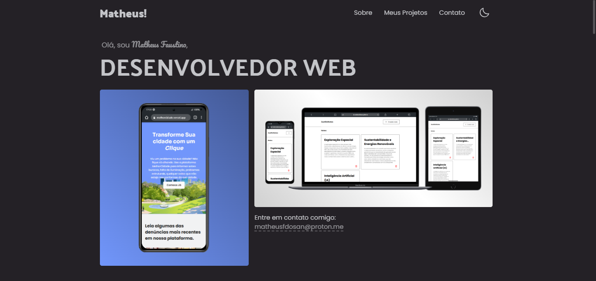

<h1 align="center"> Portfólio • Desenvolvedor Web </h1>

  <a href="#-tecnologias">Tecnologias</a>&nbsp;&nbsp;&nbsp;|&nbsp;&nbsp;&nbsp;
  <a href="#-projeto">Projeto</a>&nbsp;&nbsp;&nbsp;|&nbsp;&nbsp;&nbsp;
  <a href="#-contato">Contato</a>

  

 

## 🚀 Tecnologias

Esse projeto foi desenvolvido com as seguintes tecnologias:

- React.js
- Node.js
- GSAP
- Vite

## 💻 Projeto

Bem-vindo ao meu portfólio! Aqui você encontrará uma coleção dos meus projetos, habilidades e experiências como desenvolvedor. Sou apaixonado pela tecnologia com mais de **5 anos de experiência** em desenvolvimento web, focado em criar soluções inovadoras e eficientes.

De uma olhada no [portifólio](https://matheusdev.is-a.dev/)

## Contato

- Acesse também meus outros repositórios no [Github](https://github.com/matheusfdosan?tab=repositories).

- Também me siga no [Instagram](https://instagram.com/matheusfdosan).

- Conecte-se comingo no [Linkedin](https://www.linkedin.com/in/matheusfaus/)

- Contrate-me para o desenvolvimento de sistemas e soluções personalizadas no [99freelas](https://www.99freelas.com.br/user/matheusfdosan)
